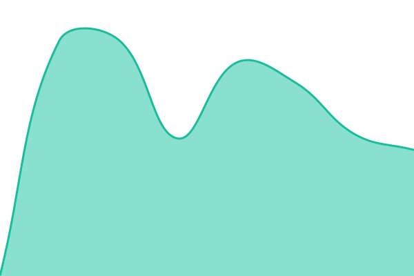

# Roberto Mota | Status

Este repositório contém o monitoramento de disponibilidade e tempo de resposta dos serviços, alimentado pelo [Upptime](https://upptime.js.org) e GitHub Actions.

## 📈 Status em Tempo Real: <!--live status--> **🟩 All systems operational**

<!--start: status pages-->
<!-- This summary is generated by Upptime (https://github.com/upptime/upptime) -->
<!-- Do not edit this manually, your changes will be overwritten -->
<!-- prettier-ignore -->
| URL | Status | History | Response Time | Uptime |
| --- | ------ | ------- | ------------- | ------ |
|  [Domínio Principal](https://rbto20.com) | 🟩 Up | [dominio-principal.yml](https://github.com/roberto-mota20/status.rbto20.com/commits/HEAD/history/dominio-principal.yml) | 

 114ms
     
 | 

<a href="https://roberto-mota20.github.io/status.rbto20.com/history/dominio-principal">100.00%</a>
    

|  [Redirecionamento](https://c.rbto20.com) | 🟩 Up | [redirecionamento.yml](https://github.com/roberto-mota20/status.rbto20.com/commits/HEAD/history/redirecionamento.yml) | 

 277ms
     
 | 

<a href="https://roberto-mota20.github.io/status.rbto20.com/history/redirecionamento">100.00%</a>
    

|  [Projetos](https://toto.rbto20.com) | 🟩 Up | [projetos.yml](https://github.com/roberto-mota20/status.rbto20.com/commits/HEAD/history/projetos.yml) | 

 233ms
     
 | 

<a href="https://roberto-mota20.github.io/status.rbto20.com/history/projetos">100.00%</a>
    

<!--end: status pages-->
